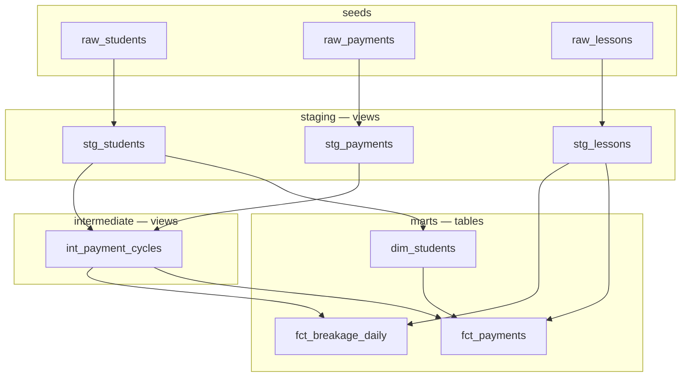

# dbt Analytics — Breakage Revenue Pipeline

A dbt project that estimates and tracks breakage revenue PayOps team.
**Breakage** = hours purchased but unused at the end of a 28-day subscription cycle.
The pipeline produces both **actual breakage** (closed cycles) and **estimated breakage** (open cycles), refreshed daily as new payments, lessons and students arrive.

---

## Quickstart

### Prerequisites
- Python 3.11
- dbt-databricks >= 1.11
- Databricks workspace with Unity Catalog

### Setup
```bash
git clone https://github.com/rishbeck1988/dbt-analytics.git
cd dbt-analytics
pip install dbt-databricks
dbt deps                          # install dbt_utils package
```

### Configure connection
Create `~/.dbt/profiles.yml`:
```yaml
preply_analytics:
  target: dev
  outputs:
    dev:
      type: databricks
      host: <your-databricks-host>
      http_path: <your-http-path>
      token: <your-personal-access-token>
      catalog: workspace
      schema: preply
      threads: 2
```

### Run
```bash
dbt seed                          # load raw CSVs into Databricks
dbt run                           # build all models in dependency order
dbt test                          # run all 56 tests
```

### Run specific layers
```bash
dbt run --select staging
dbt run --select intermediate
dbt run --select marts
```

### Variables
| Variable | Default | Description |
|---|---|---|
| `as_of_date` | `2026-04-17` | Point-in-time date. Set to `current_date()` in production |
| `cycle_length_days` | `28` | Subscription cycle length in days |

Override for production:
```bash
dbt run --vars '{"as_of_date": "2026-05-01", "cycle_length_days": 28}'
```

---

## Business context

Preply is a subscription-based tutoring marketplace. Students buy plans of 4, 6, 8, 10, 12, 16 or 20 hours. Each plan has a 28-day cycle. Hours expire at cycle end — unused hours are **breakage revenue** for Preply.

### How Preply earns revenue
| Source | Formula |
|---|---|
| Commission | 20% × hours_booked × price_per_hour |
| Breakage | 100% × hours_unbooked × price_per_hour |

### Example
```
Payment: 8 hours @ $10/hour = $80 plan
Booked:  6 hours within 28-day cycle
Unbooked: 2 hours

Commission = 6 × $10 × 20% = $12
Breakage   = 2 × $10        = $20
Total      = $32  (recognised on cycle close date)
```

### The problem
Breakage is only known when a cycle closes. PayOps needs a **daily estimate** for open cycles so they can monitor expected revenue without waiting 28 days.

---

## Data model
### DAG
```
raw_students ──► stg_students ──► int_payment_cycles ──────────────────────────► fct_payments
raw_payments ──► stg_payments ──► int_payment_cycles                             fct_breakage_daily
raw_lessons  ──► stg_lessons  ──────────────────────────────────────────────────► fct_breakage_daily
raw_students ──► stg_students ──► dim_students ──────────────────────────────────► fct_payments
```

### DAG-Mermaid


### Model reference

| Model | Grain | Materialisation | Purpose |
|---|---|---|---|
| `stg_students` | one row per student | view | clean raw_students |
| `stg_payments` | one row per payment | view | clean raw_payments, rename columns |
| `stg_lessons` | one row per lesson | view | clean raw_lessons, filter invalid rows |
| `int_payment_cycles` | one row per payment | view | cycle boundaries, open/closed logic, student dims |
| `dim_students` | one row per student | table, full refresh | student segments and cohorts |
| `fct_payments` | one row per payment | incremental, merge | current state — PayOps headline metrics |
| `fct_breakage_daily` | one row per payment per day | incremental, merge | daily snapshots — estimate evolution |

---

## Approach

### Grain decision
`fct_payments` — one row per payment — is the primary dashboard table. PayOps monitors by payment cycle and can aggregate to any dimension. `fct_breakage_daily` adds a daily snapshot layer enabling convergence analysis (how estimates improve as days pass).

### Estimation formula

Breakage is estimated differently depending on days elapsed in the cycle:

| Method | When | Formula |
|---|---|---|
| `actual` | cycle closed | `hours_purchased - hours_booked` |
| `fully_booked_zero` | all hours used | `0` |
| `historical_rate_fallback` | day 0, no burn data | `hours_purchased × avg_breakage_rate_for_plan_size` |
| `burn_rate_projection` | days 1–27 | `max(hours_purchased - (daily_burn_rate × 28), 0)` |

Day 0 fallback uses the historical average breakage rate for that plan size from all closed cycles. If no plan-specific rate exists, the overall portfolio average is used — no hardcoded constants.

### Revenue model
```
Commission  = 20% × hours_booked × price_per_hour
Breakage    = 100% × hours_unbooked × price_per_hour
Total       = commission + breakage
```

### Cycle boundary
```
cycle_start = payment_date
cycle_end   = payment_date + 27 days  (last active day, inclusive)
next cycle  = payment_date + 28 days
```

Verified against assignment example: Jan 5 + 27 = Feb 1 ✅

### Aggregation rules
```
✅ SUM breakage_usd across payments on same snapshot_date  → valid
✅ SUM actual_breakage_usd across all closed cycles        → valid
❌ SUM estimated_breakage_usd across days for same payment → double counting
```

---

## Key assumptions and trade-offs

| Decision | Chosen | Alternative | Reason |
|---|---|---|---|
| Student dims | SCD Type 1 | SCD Type 2 | Sufficient for PayOps operational segmentation |
| Intermediate layer | one model only | three models | Only int_payment_cycles serves multiple consumers |
| Shared formula logic | dbt macros | duplicate in each mart | Single source of truth for breakage calculation |
| Fallback rate | portfolio average | hardcoded constant | Data-driven, no magic numbers |
| as_of_date | variable | current_date() | Fixed for dataset, switch for production |
| Student dims in fct | snapshotted at INSERT | join at query time | Preserves historical segment attribution |
| DQ enforcement | WHERE clause in staging | separate DQ models | Avoids redundant compute on view chains |

---

## Caveats and limitations

1. **Estimated breakage accuracy** — day 0 estimates rely on historical averages and are least accurate. Accuracy improves as days_elapsed increases toward day 27.

2. **Open cycle revenue** — `total_revenue_usd` on open cycles combines confirmed commission with estimated breakage. Not recognised revenue — do not use for financial reporting.

3. **Student dimensions** — reflect current attributes (SCD Type 1). If a student changes country, all historical payments show the new value. In production, SCD Type 2 with dbt snapshots would give historically accurate segment attribution.

4. **Overbooking** — 186 payments (2% of total) show `hours_booked_so_far > hours_purchased`. Investigation confirmed all lessons fall correctly within cycle boundaries with no date filter or timezone issues — this is genuine source system behaviour where the platform did not enforce a hard cap on lesson bookings within a cycle.

   Example: payment `150003881` purchased 8 hours but booked 12 hours across 12 lessons within the Dec 25 → Jan 21 window. All 12 lessons correctly fall within the cycle.

   Our model handles this correctly:
   - `commission_usd` capped at `hours_purchased × price × 20%`
   - `actual_breakage_hours` floored at 0 via `greatest(..., 0)`
   - `is_overbooked = true` flags these payments for PayOps investigation
   - `no_overbooking` test set to `warn` — does not block pipeline

5. **Aggregation warning** — `breakage_usd` in `fct_breakage_daily` is a point-in-time estimate per day. Never sum across snapshot_dates for the same payment.

6. **Static dataset** — `as_of_date` is fixed at 2026-04-17. Switch to `current_date()` for production runs.

7. **Partitioning** — `partition_by` config was not applied due to a syntax change in dbt-databricks 1.12.0. Delta Lake Liquid Clustering via `CLUSTER BY` would be the correct approach for production deployment.

---

## Tests

### Run tests
```bash
dbt test                          # all 56 tests
dbt test --select staging         # staging only
dbt test --select intermediate    # intermediate only
dbt test --select marts           # marts only
```

### Schema tests
- `unique` and `not_null` on primary keys
- `accepted_values` on `cycle_status`, `estimation_method`, `lifecycle_stage`, `student_type`
- `expression_is_true` — `hours_purchased between 4 and 20` in staging
- `unique_combination_of_columns` on `fct_breakage_daily (payment_id, snapshot_date)`

### Custom business logic tests
| Test | What it checks |
|---|---|
| `no_overbooking` | hours_booked_so_far never exceeds hours_purchased (severity: warn) |
| `closed_cycles_have_actual_breakage` | closed cycles always have actual_breakage_hours populated |
| `breakage_not_exceed_plan` | breakage_hours never exceeds hours_purchased |
| `cycle_length_check` | cycle_end exactly 27 days after cycle_start in int_payment_cycles |
| `fct_payments_cycle_length_check` | cycle_end exactly 27 days after cycle_start in fct_payments |
| `hours_reconciliation` | hours_booked + actual_breakage = hours_purchased for non-overbooked closed cycles |
| `int_cycle_end_after_start` | cycle_end always after cycle_start |
| `total_revenue_not_exceed_plan` | commission + breakage never exceeds plan value |
| `payment_count_reconciliation` | fct_payments row count matches stg_payments |
| `plan_value_reconciliation` | total plan value matches between staging and mart |
---

## Daily pipeline (production)
```
06:00  raw data lands (new payments, lessons, students)
06:30  dbt run:
         staging views      → recompute instantly against latest raw data
         int_payment_cycles → recompute, new payments included,
                              expired cycles flip to closed automatically
         dim_students       → full refresh (3,000 rows)
         fct_payments       → incremental merge, last 28 days only
         fct_breakage_daily → incremental merge, today's snapshot appended
07:00  PayOps dashboard refreshes
```

---

## Scalability notes

At current volume (~53K lessons, ~9.7K payments) the model runs efficiently as views + incremental tables. At 10x–100x scale:

1. `int_payment_cycles` would be materialised as an incremental table with 28-day lookback filter
2. The lesson-to-cycle range join would need `RANGE_JOIN` hints in Databricks
3. `fct_breakage_daily` would need a retention policy (e.g. 90-day window) to bound table size
4. Look at partitioning strategy
---

## What I'd build next
- **`agg_breakage_daily`** — pre-aggregated daily summary for faster dashboard queries at scale
- **`fct_lessons`** — lesson-level fact table enabling burn pattern analysis and lesson frequency metrics
- **SCD Type 2 on `dim_students`** — using dbt snapshots for historically accurate segment attribution
- **Airflow DAG** — `dbt run → dbt test` sequenced daily with alerting on test failures
- **Confidence intervals** — breakage estimate ranges using historical variance by plan size and days elapsed
- **Liquid Clustering** — apply `CLUSTER BY (cycle_start, cycle_status)` on fct tables for production query performance
---

## AI usage note

### Where AI helped
- Scaffolding dbt project structure and boilerplate SQL
- Suggesting the `estimation_method` column for debuggability and auditability
- Generating macro structure for shared breakage formula logic
- Drafting README structure and test descriptions
- Generating dashboard query templates

### Where I rejected or corrected AI output
- AI initially suggested hardcoding `0.25` as fallback breakage rate — replaced with data-driven overall portfolio average derived from closed cycles
- AI suggested SCD Type 2 for students — simplified to Type 1 after evaluating trade-offs for this use case and time constraints
- AI over-engineered DQ with a separate model layer — simplified to WHERE clause filtering in staging with custom SQL tests
- AI suggested `fct_payments` reading from `fct_breakage_daily` (mart-to-mart) — rejected due to incremental logic breaking and unnecessary dependency chain
- AI initially used `cycle_end = payment_date + 28` — corrected to `+27` (last active day inclusive) after careful reading of the assignment example (Jan 5 → Feb 1 = 27 days)
- AI suggested 130 schema tests — trimmed back to 56 meaningful tests avoiding duplication with custom SQL tests
- AI suggested `sequence()` generating 29 rows per payment — corrected to 28 by capping at `cycle_end` which is now correctly `payment_date + 27`

### How I verified
- Ran exploratory SQL in Databricks before writing any dbt models to understand data shape and distribution
- Checked row counts at each layer (seeds → staging → intermediate → marts)
- Manually verified breakage calculation against assignment example ($80 plan, 6 booked, 2 unbooked = $12 commission + $20 breakage)
- Cross-checked open vs closed cycle counts — 811 open, 8,884 closed
- Investigated 186 overbooking cases — confirmed genuine source data issue via lesson-level queries showing all lessons within correct cycle boundaries
- Verified cycle boundary logic: Jan 5 + 27 = Feb 1 matches assignment example
